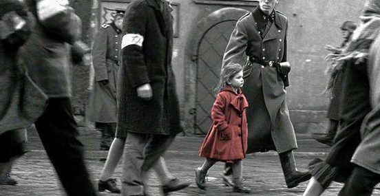
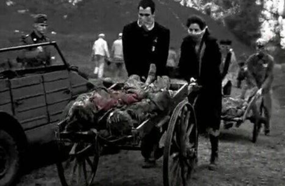
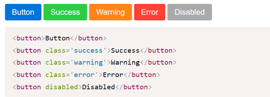

# chma0264_9103_tut5
## 1. Imaging Technique: Colour Contrast

In some movies or games, colour contrasts are often used to highlight certain objects in the scene. An iconic example is the little girl in red in "Schindler's List", who stands out against her surroundings. Every time she appears, she quickly captures the audience's attention. This stark contrast holds deep symbolic significance.

By creating visual focal points through colour differences, we offer an element for the audience to anchor onto. Highlighting specific elements or characters silently steers the viewer's emotions, reactions, and interpretations. Additionally, pronounced colour contrasts often leave a lasting impression on viewers. Simple colour deviations can trigger a wide range of emotions and interpretations, allowing the story to resonate more profoundly.

## 2. Coding Technique: Using CSS Library

Existing CSS libraries, such as **Picnic CSS**—a lightweight, modular CSS library. It facilitates swift implementations of attributes changes like colours. Its lightweight nature trims down preload times, while the modular framework offers agility in tweaking attributes across segments. This results in pronounced colour contrasts for particular elements or page sections by customizing one's colour scheme. Such contrast doesn't just boost visual aesthetics but also channels the user's gaze towards pivotal content or calls-to-action.

In the example below, different colours and styles can be achieved by merely assigning the `button` to the corresponding `class`:

[Picnic CSS on GitHub](https://github.com/franciscop/picnic)
